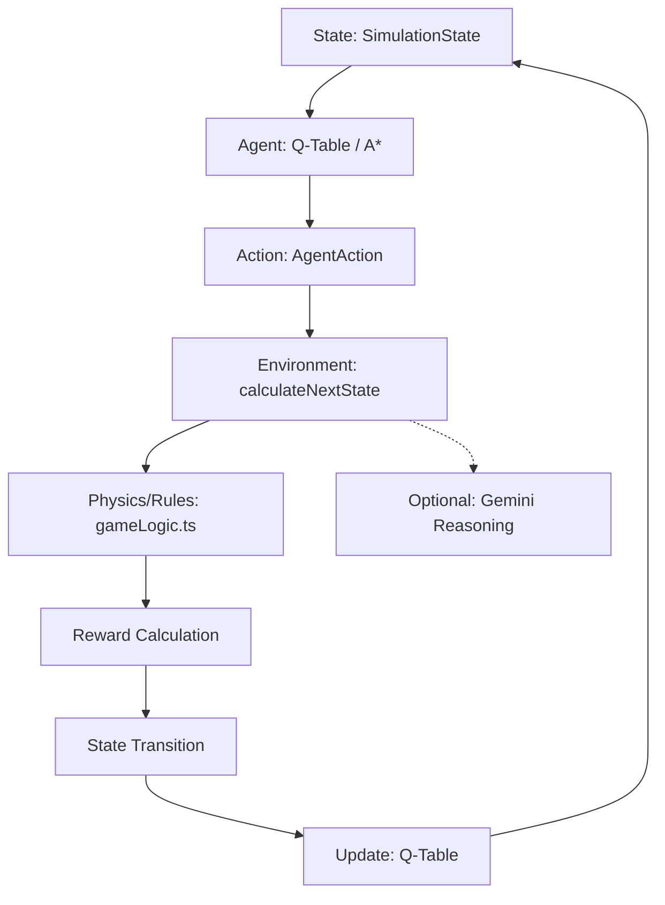

# AgentX: Temporal RL Research Environment

AgentX is a high-fidelity Reinforcement Learning (RL) simulation and visualization platform designed to evaluate agent performance in non-stationary grid-world environments featuring a "Temporal Capacitor" (rewind) mechanic. It provides a research-grade sandbox for testing Q-Learning convergence, exploration-exploitation trade-offs, and hierarchical decision-making under high-penalty constraints. The project exists to solve the problem of testing RL efficiency in environments where catastrophic failure (e.g., poison hazards) can be mitigated by state-reversal rather than simple termination, enabling more complex path refinement strategies.

**Project Maturity:** MVP / Research Prototype.

---

## 2. Key Features

- **Temporal Reversal Engine (`gameLogic.ts`):** A state-buffer system that allows the agent to revert up to 5 steps back into the past upon triggering lethal hazards, consuming a finite "Rewind Budget."
- **Dual-Mode Intelligence (`qLearningService.ts`):** 
    - **Training Mode:** Implements Epsilon-Greedy Q-Learning with curriculum-based decay and policy retention across levels.
    - **Test Mode:** Switches to a deterministic A* pathfinding algorithm to establish an optimal performance baseline on randomized maps.
- **Procedural Dungeon Generation (`App.tsx`):** Algorithms ensure at least two distinct safe paths to the goal while dynamically scaling trap density and maze complexity based on the current level.
- **Bi-Level Reward System (`constants.ts`):** Decouples internal RL penalties (steps, poison, rewinds) from the user-facing "Visible Score" (coins, level clears) to maintain a positive progress metric for human observers.
- **AI-Augmented Reasoning (`geminiService.ts`):** Optional integration with Google Gemini (gemini-3-flash-preview) to provide high-level linguistic reasoning for agent actions based on grid-state snapshots.
- **Real-Time Analytics (`MetricsPanel.tsx`):** Live telemetry visualization using Recharts to track cumulative rewards, step efficiency, and historical episode performance.

---

## 3. System Architecture

The system operates as a synchronous State-Action-Reward-State (SARS) loop orchestrated by the React render cycle.



---

## 4. Tech Stack

- **Runtime:**
    - **Framework:** React 19.0.0
    - **Language:** TypeScript 5.x
    - **Styling:** Tailwind CSS (CDN-delivered)
    - **Intelligence:** @google/genai 1.33.0
    - **Data Viz:** Recharts 3.5.1
- **Development:**
    - **Build Tool:** ESM-based (Vite/browser-native imports)
    - **Environment Management:** Browser-injected `process.env` variables

---

## 5. Project Structure

```text
.
├── App.tsx                 # Application Orchestrator & UI Layout
├── index.tsx               # Entry point (React Root)
├── types.ts                # Strict TypeScript interfaces & Enums
├── constants.ts            # Simulation Hyperparameters (Rewards, Colors)
├── services/
│   ├── gameLogic.ts        # Physics engine & SARS transition logic
│   ├── qLearningService.ts # Q-Learning brain & Pathfinding implementation
│   └── geminiService.ts    # Google Gemini API integration
├── components/
│   ├── GridWorld.tsx       # SVG/CSS based 2D environment visualization
│   ├── MetricsPanel.tsx    # Live telemetry & charts (Recharts)
│   ├── ControlPanel.tsx    # Simulation & Budget controls
│   └── ResearchSpec.tsx    # Formal environment documentation
├── metadata.json           # Application metadata
└── index.html              # HTML shell & font/styling imports
```

---

## 6. Setup & Installation

### Requirements
- A modern web browser with ESM support.
- A valid Google Gemini API Key (for reasoning features).

### Installation Steps
1. Clone the repository to your local machine.
2. Serve the root directory using a static server:
   ```bash
   # Using Node.js
   npx serve .
   
   # Using Python
   python3 -m http.server 8000
   ```
3. Open `http://localhost:8000` in your browser.

### Environment Variables
- `API_KEY`: Required in the execution context for `geminiService.ts`. Ensure this is injected by the platform or set in your environment.

---

## 7. Usage

- **Training:** Click **TRAIN** to initiate the epsilon-greedy learning loop. The agent will explore and populate its Q-Table.
- **Evaluation:** Click **TEST** to generate a randomized medium-complexity map and evaluate the agent using deterministic optimal pathfinding.
- **Temporal Reset:** The agent automatically uses **REWIND** when trapped in a lethal hazard if the budget > 0.
- **Speed Control:** Use the **Clock Speed** slider to overclock the simulation (up to 20ms/tick) or slow it down for analysis.

---

## 8. Configuration

Adjustable parameters in `constants.ts` and `DEFAULT_CONFIG`:

| Parameter | Default Value | Impact |
| :--- | :--- | :--- |
| `stepPenalty` | -1 | Penalizes inefficient movement. |
| `trapPenalty` | -50 | Massive negative reward for lethal contact. |
| `rewindCost` | -5 | Cost per temporal reversal. |
| `rewindSteps` | 5 | Number of steps reverted per rewind action. |
| `epsilon` | 0.85 (decaying) | Controls exploration rate. |

---

## 9. Testing

The project utilizes automated state-transition validation within `gameLogic.ts`.
- **Unit Testing:** Logic is contained in pure functions (`calculateNextState`) making them eligible for Jest/Vitest.
- **Integration Testing:** Performed via "Test Mode" inside the UI which validates pathfinding success on 100+ randomized procedural seeds.

---

## 10. Performance / Constraints

- **Bottlenecks:** Re-rendering a 20x20 grid (400 cells) every 20ms. Optimized via `React.memo` and localized prop passing in `GridWorld.tsx`.
- **Memory:** Historical state buffers for rewinds are capped at 100 entries to prevent memory leaks during long-running sessions.
- **Scalability:** Grid sizes above 30x30 significantly impact SVG rendering performance on mobile devices.

---

## 11. Security Considerations

- **API Keys:** The Gemini API Key is handled via `process.env.API_KEY`. It is never hardcoded.
- **Client-Side:** As a pure frontend application, the attack surface is limited to XSS if user-generated content were to be introduced (none currently exists).
- **Insecure:** API keys are exposed in client-side network requests; use a proxy in production.

---

## 12. Known Issues & Limitations

- **Technical Debt:** The A* algorithm in Test Mode currently prioritizes the shortest path and does not optimize for coin collection.
- **Agent Memory:** Q-Learning is state-based; the agent has no memory of long-term sequences unless represented in the state-key.
- **Map Persistence:** Maps are regenerated upon level clearing; there is currently no "Map Editor" mode.

---

## 13. Roadmap

- **Short-term:** Implementation of Deep Q-Networks (DQN) to handle continuous state spaces.
- **Long-term:** Multi-agent support (Competitive/Cooperative) and Fog-of-War (Partial Observability).

---

## 14. Contribution Guidelines

1. **Coding Standard:** Strict TypeScript. No `any` types. Pure functions for logic.
2. **Branching:** Use `feature/` or `fix/` prefixes.
3. **PRs:** Ensure `calculateNextState` tests pass and `GridWorld` performance is maintained.

---

## 15. License

Not licensed yet. Private research repository.